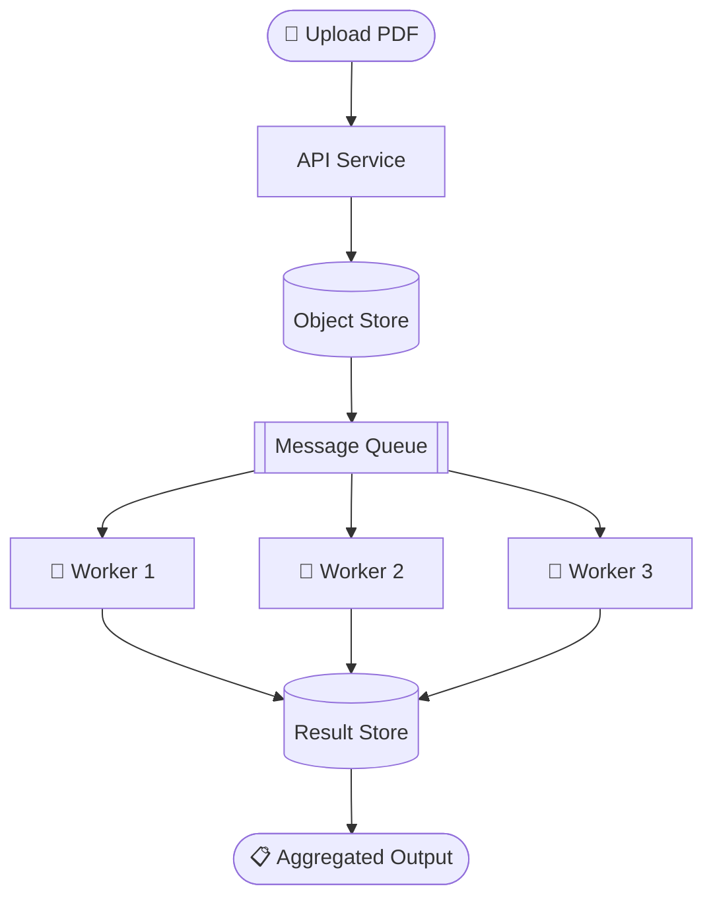

<div align="center">

# 🐝 PageSwarm

**Distributed Document Processing — Break It Down, Swarm It Out**

[](https://python.org)
[](https://fastapi.tiangolo.com)
[](https://aws.amazon.com)
[](https://docs.docker.com/compose/)
[](LICENSE)

<br/>


*Upload a PDF. Fan out every page. Process them in parallel. Reassemble the result.*

<br/>



</div>

---

## ✨ Project Overview

PageSwarm is a distributed document processing platform for page-level fan-out workloads.
It is designed around a simple but powerful flow:

1. Accept a document upload.
2. Split the work into page-sized jobs.
3. Dispatch jobs through a queue.
4. Process pages in parallel workers.
5. Reassemble and return the aggregate output.

The project demonstrates production-style distributed systems patterns with a local developer setup powered by Docker Compose and LocalStack.

## 🧠 Why This Project Exists

PageSwarm exists to demonstrate how to build reliable, scalable processing pipelines with clear service boundaries:

- Decoupled producers and consumers via messaging
- Horizontal worker scaling for throughput
- Fault-tolerant retry behavior for transient failures
- Idempotent page processing to survive duplicates
- Structured observability for API and worker flows

## 🧱 Architecture At A Glance

| Layer | Responsibility |
|---|---|
| API | Accept uploads, validate input, create processing jobs |
| Storage | Persist source documents and intermediate/final artifacts |
| Queue | Buffer page-level jobs and decouple API from workers |
| Workers | Process each page independently and emit structured outputs |
| Aggregation | Reorder and combine page results into final output |

## 📦 Repository Layout

| Path | Purpose |
|---|---|
| `docker-compose.yml` | Local orchestration for all services |
| `server/` | FastAPI service for upload and API workflows |
| `localstack-data/` | LocalStack data/state for local development |

Module-level technical docs live with each component.

- API module docs: [server/README.md](server/README.md)

## 🛠️ Technology Stack

| Component | Technology |
|---|---|
| Language | Python 3.12+ |
| API | FastAPI |
| Queue / Object APIs | AWS SQS + S3 (via LocalStack in dev) |
| PDF handling | PyPDF |
| Runtime / Orchestration | Docker + Docker Compose |

## 🚀 Quick Start (Whole Project)

Start all defined services:

```bash
docker compose up --build
```

Verify API health:

```bash
curl http://localhost:8000/api/health
```

Try a document upload:

```bash
curl -X POST \
    -F "file=@/path/to/document.pdf" \
    http://localhost:8000/api/v1/documents/upload
```

## 🗺️ Documentation Strategy

This README is intentionally high-level.

- Root README: project intent, architecture, quick start, and navigation
- Component README files: implementation details, local module commands, and technical reference

## ✅ Current Status

| Area | Status |
|---|---|
| API foundation | In progress |
| LocalStack integration | In progress |
| Queue fan-out | Planned |
| Worker orchestration | Planned |
| Aggregation pipeline | Planned |

## 🗺️ Roadmap

- [ ] Core API endpoints: upload, status, result
- [ ] S3 document storage integration
- [ ] SQS page-job fan-out
- [ ] Worker pool + page processing loop
- [ ] Result aggregation by page order
- [ ] Retry and dead-letter strategy
- [ ] Integration and resilience tests
- [ ] Live progress updates

---

## 📜 License

This project is licensed under the [MIT License](LICENSE).

---

<div align="center">

**Built by [Jonathan](https://github.com/jonnyboy1241)** · Distributed systems in action · 🐝

</div>